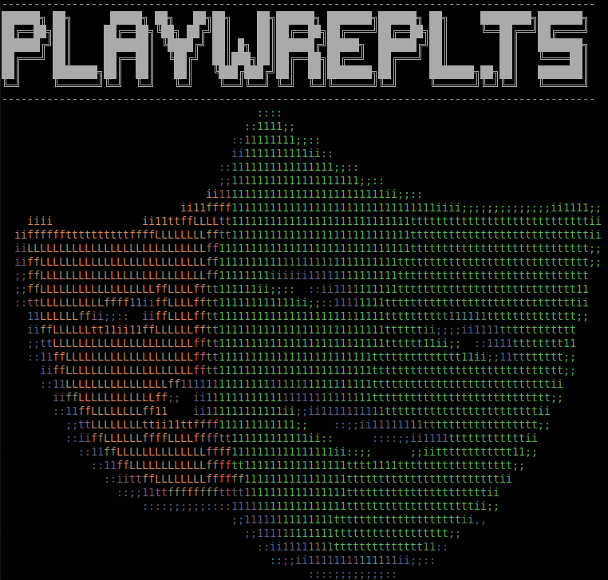
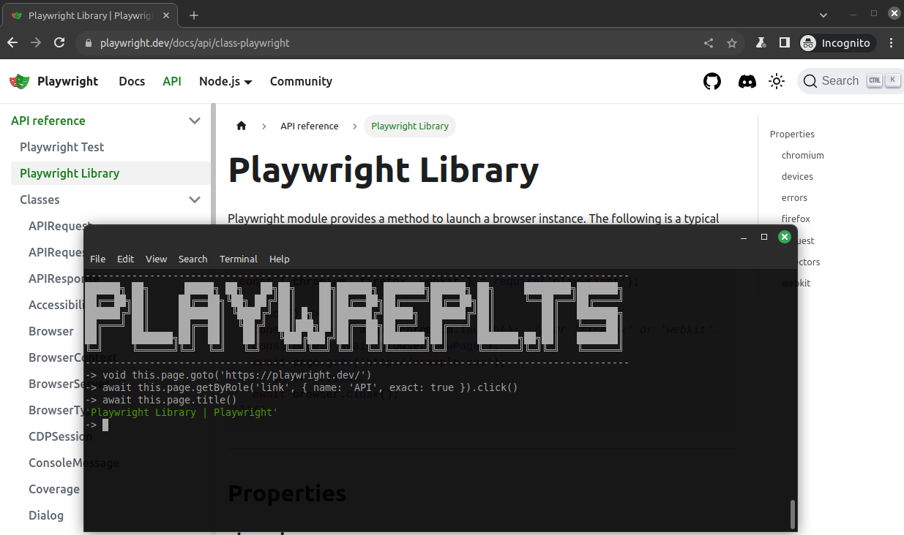

# playwrepl.ts


Playwrepl.ts is quite simple node REPL server script that allow you controlling playwright from the command line using TypeScript code. When you start the tool in will open a node REPL server in the terminal and the open a chromium browser and expose some playwright object to the REPL server for interacting with browser using playwright api. playwrepl.ts is a [node REPL](https://nodejs.org/api/repl.html) server that utilizes [ts-node](https://github.com/TypeStrong/ts-node) repl service to compile Typescript code at runtime. The tool supports code completion using the tab key as well.
Playwrepl.ts is a very handy tool when it comes to tryout slightly more complicated stuff than just picking a singe locator. It's a great tool when you are learning playwright because you can manually navigate browser to the place you want to explore and the start exploring different coding stuff from the command line. 




## Getting started
1. Clone this repo [playwrepl.ts](https://github.com/marcusNumminen/playwrepl.ts)
2. Run: `npm install`
3. Run: `npx playwright install chromium`
4. Start the tool by: `npx ts-node ./playwrepl.mts`

If you use node version 20.x.x the you should start the tool by: `node --loader ts-node/esm ./playwrepl.mts`

## How the tool works
There are some command line options that could be used when starting the tool:
```bash
$ npx ts-node ./playwrepl.mts -h
Usage: playwrepl.ts [options]

playwright by command line

Options:
  -V, --version                  output the version number
  -u, --url <baseUrl>            The url to be opened by the browser
  -e, --extraHttpHeaders <prop>  extra http headers, use the format name:value (default: [])
  -s, --storageState <path>      path to storage state
  -h, --help                     display help for command

```
The command line options `--url`, `--storageState` and `--extraHttpHeaders` reflects the `baseURL`, `extraHTTPHeaders` and `storageState` options when creating new browser context (see: https://playwright.dev/docs/api/class-browser#browser-new-context)

Playwrepl.ts have the normal node [REPL commands](https://nodejs.org/api/repl.html#commands-and-special-keys) but also two additional as well:
```
-> .help
.break              Sometimes you get stuck, this gets you out
.clear              Break, and also clear the local context
.editor             Enter editor mode
.exit               Exit the REPL
.help               Print this help message
.load               Load JS from a file into the REPL session
.save               Save all evaluated commands in this REPL session to a file
.saveStorageState   Save current storage state 
.showLogo           Show the amazing playwrepl.ts logo

Press Ctrl+C to abort current expression, Ctrl+D to exit the REPL
```
`.saveStorageState` will save the current sessions storage state and `.showLogo` will show some amazing console graphics :)

## Exposed playwright objects
playwrepl.ts exposes several playwright object connected to the opened browser that could be used within the REPL:
* `browser` - [Browser](https://playwright.dev/docs/api/class-browser) object connected to the opened browser
* `context` - [BrowserContext](https://playwright.dev/docs/api/class-browsercontext) object connected to the opened browser
* `page` - [Page](https://playwright.dev/docs/api/class-page) object connected to the opened browser page
* `expect` - see https://playwright.dev/docs/test-assertions
* `request` - [APIRequest](https://playwright.dev/docs/api/class-apirequest) to be able to do request outside the browser.

All of these object object is tied to the `this` object

## REPL history
playwrepl.ts store all the executed command in a `.history` file in the root of the repo and you can access history using the arrow keys within the repl.

## Examples
Lets use [saucedemo.com](https://www.saucedemo.com/) for a simple demo when we interact with the browser:
```typescript
-> void await this.page.goto('https://www.saucedemo.com/')
-> await this.page.locator('[data-test="username"]').fill('standard_user')
-> await this.page.locator('[data-test="password"]').fill('secret_sauce')
-> await this.page.locator('[data-test="login-button"]').click();
-> await this.page.locator('.inventory_item').count()
```

Lets do a simple rest request using the [pet store](https://petstore.swagger.io) sample site:
```typescript
-> const reqContext = await this.request.newContext({baseURL: 'https://petstore.swagger.io/'})
-> const resp = await reqContext.get('v2/store/inventory')
-> resp.status()
200
-> await resp.json()
{
  '3000': 1,
  '5000': 1,
  '6000': 1,
  '7000': 1,
  sold: 43,
  string: 617,
  unavailable: 7,
  availeble: 1,
  pending: 31,
  available: 280,
  avalible: 1,
  bold: 1,
  SOLD: 1,
  Available: 2,
  'Not available': 3,
  status: 1
}
```
## Load scripts
We can create scripts and load these using the `.load` command from within the playwrepl.ts:
```
-> .load scripts/sample.mts
void await this.page.goto('https://www.saucedemo.com/')
await this.page.locator('[data-test="username"]').fill('standard_user')
await this.page.locator('[data-test="password"]').fill('secret_sauce')
await this.page.locator('[data-test="login-button"]').click();
await this.page.locator('.inventory_item').count()
... 6
```

## Known issues
* import within the repl do not work:
```
> import dotenv from "dotenv"
/home/stuffy/projects/playwrepl.ts/<repl>.ts:1
export {};
^^^^^^

Uncaught SyntaxError: Unexpected token 'export'
```
See: https://github.com/TypeStrong/ts-node/issues/2005

